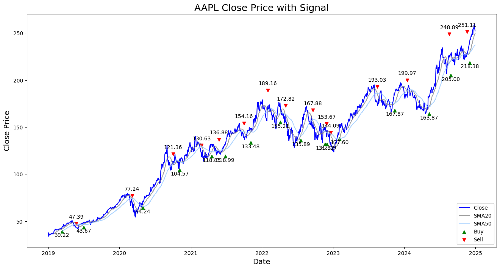

# Simple Moving Average (SMA) Crossover Trading Strategy in Python

The SMA Crossover strategy provides buy and sell signals based on when the SMA20 crosses over the SMA50.
- An upward cross generates a buy signal.
- A downward cross generates a sell signal.

### Aims:
- Download price data.
  - Get price data for multiple symbols from Yahoo! Finance.
  - Save to a local file to minimise API calls.
  - Extract price data for a single symbol from the `MultiIndex` `DataFrame` into a single index `DataFrame`.
- Generate indicator and signal data.
  - Generate the short and long period SMAs.
  - Generate a `Signal` column to identify whether the SMA20 is above or below the SMA50.
  - Generate a `Position` column to identify when a crossover occurs.
  - Generate `Buy` and `Sell` columns with the containing the price at which the crossover occurs. Set all other rows to `numpy.NaN`.
- Plot the price and the signal on a line chart.

### Libraries
- `matplotlib.pyplot`: To visualise price data
- `os` module (Standard library): File path handling
- `numpy`
- `pandas`: `DataFrame` for time series data
- `requests`: Handle sessions for API calls.
- `yfinance`: Get data from the Yahoo Finance API